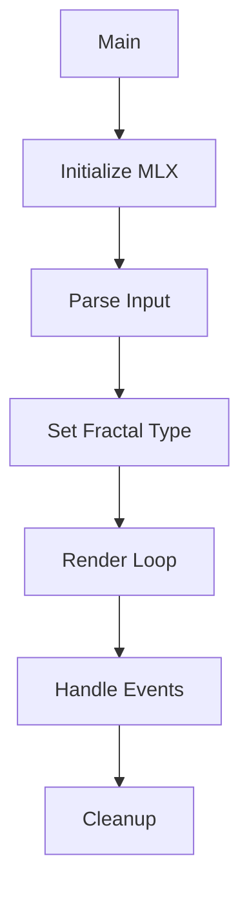

# fract-ol – Interactive Fractal Explorer

**fract-ol** is an interactive fractal visualization tool built in C using MiniLibX. Explore beautiful mathematical sets with real-time zoom, pan, and parameter control. Designed for efficiency and smooth user experience.

---

## Features

### Supported Fractals

| Fractal       | Description                     | Command Example                        |
|---------------|---------------------------------|----------------------------------------|
| Mandelbrot    | Classic self-similar set        | `./fractol mandelbrot`                 |
| Julia         | Customizable real/imaginary     | `./fractol julia -0.7 0.27015`         |
| Burning Ship  | "Fractal Smiley" variant        | `./fractol burningship`                |

### Interactive Controls

- Mouse Wheel: Smooth zoom (up to 10⁶× magnification)
- Right Click: Set Julia parameters (for Julia set)
- Keyboard:
  - ESC: Quit
  - Arrow Keys: Pan view
  - M: Switch to Mandelbrot
  - J: Switch to Julia

<details>
  <summary>Sample Key Bindings (<code>hooks.c</code>)</summary>

  ```c
  int key_hook(int keysym, t_data *data) {
      // ESC to quit
      // Arrow keys to pan
      // M/J to switch fractals
  }
  ```
</details>

---

## Technical Design



---

## Performance Optimization

1. Selective Rendering: Only redraw changed regions for efficiency.
   ```c
   // In paint_fractal():
   while (rp.y < HEIGHT) {
       // Only recalculate changed regions
   }
   ```
2. Efficient Math Operations: Fast complex arithmetic.
   ```c
   // complex.c
   t_complex square_complex(t_complex comp) {
       return (t_complex){
           .real = comp.real*comp.real - comp.img*comp.img,
           .img = 2*comp.real*comp.img
       };
   }
   ```

---

## Project Structure

```
fract-ol/
├── includes/          # Header files
│   └── fractol.h      # Main definitions
├── src/               # Core implementation
│   ├── fractals/      # Fractal algorithms
│   │   ├── mandelbrot.c
│   │   ├── julia.c
│   │   └── burningship.c
│   ├── complex.c      # Complex number math
│   ├── hooks.c        # User input handling
│   └── rendering.c    # Display logic
└── libft/             # Custom utility library
```

---

## Installation & Usage

### Prerequisites

- MiniLibX (provided by 42 or compile from source)
- Standard math library (`-lm`)

### Build

```bash
git clone https://github.com/TuqaSa/fract-ol.git
cd fract-ol
make
```

### Run

```bash
# Mandelbrot
./fract-ol mandelbrot

# Julia (custom params)
./fract-ol julia -0.7 0.27015

# Burning Ship
./fract-ol burningship
```

---

## Examples

**Mandelbrot Set**  


**Julia Set (Custom Parameters)**  


**Burning Ship Set**  
 


---

## Testing

```bash
# Run all test cases
make test

# Memory check
valgrind --leak-check=full ./fract-ol mandelbrot
```

---

## Skills Demonstrated

- Mathematical visualization (complex plane transformations)
- Performance optimization (60 FPS rendering)
- Robust event handling (keyboard & mouse)
- Low-level computer graphics (pixel manipulation)

---

## License

This repository is part of the 42 curriculum and intended for educational use.
Reuse or distribution outside of 42's policy is discouraged unless properly credited.
